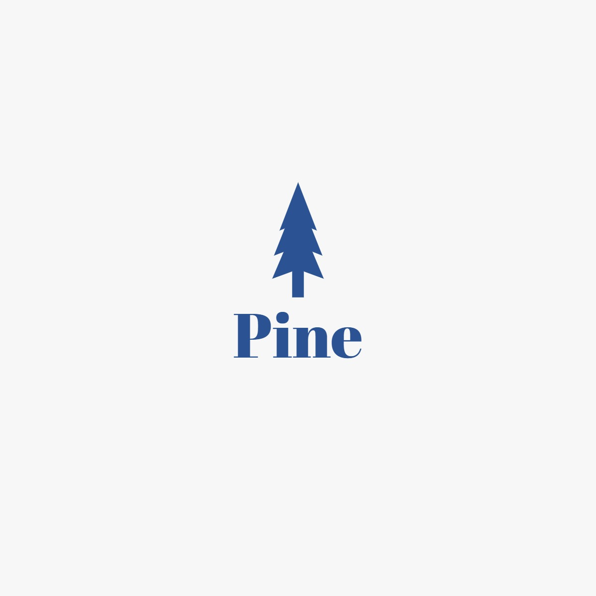

# CityHack22 Project Submission
## Project: Pine

## Team: TBA…
## Members
- KAWLE Shreyash Sanjay (Leader)
- ZHANG Yuxin 
- HER Sojeong
- KIM Hyeon
- CHOW Chun Kit

## Description of the Project (300 words)
Reduce surplus/shortage in medication production and avoid unnecessary waste due to expiration or underproduction which could endanger patients’ health with the help of ANN analytics on historical time-series datas and predict the future time-series. Also provides a large data regarding various medicines ad their alternatives and other necessary datas for general consumers. Possible future aspects to expand the datasets and have experts on real-time interactions to help connect like minded experts around the world. 

## 3 Most Impactful Features of the Project (with Screenshot and Short Description (150 words))
1. Historical and Future Predictive Time-Series Stamp
2. Data resource hub for all the medicines maybe used for research another prospectives
3. Open-source medical library for the public

## Tech used (as many as required)
1. Prediction model - Artificial Neural Networks (ANN)
2. UI development and web Development 
3. Regression model application to Neural Networks
4. AWS SageMaker and GPU Accelerators 

## Link
- Prototype: https://www.figma.com/proto/0zJV5OdBLlMi7TlKa5L1p3/PINE?node-id=128%3A1728&scaling=scale-down&page-id=0%3A1&starting-point-node-id=128%3A1728
